# CareerVision 🛡️

> **Build Smart Careers. Stay Safe from Scams.**

A full-stack AI-powered career platform with resume analysis, scam detection, mock interviews, skill gap detection, resume roasting, and an intelligent boss-personality chatbot.

---

## 📁 Project Structure

```
CareerShield-AI/
├── client/                          # React + Vite frontend
│   ├── src/
│   │   ├── App.jsx                  # All pages, components & features
│   │   └── main.jsx                 # React entry point
│   ├── index.html                   # HTML shell
│   ├── vite.config.js               # Vite config (proxy → backend)
│   ├── package.json
│   ├── .env.example                 # ← copy to .env
│   ├── .gitignore
│   └── .eslintrc.cjs
│
├── server/                          # Node.js + Express backend
│   ├── routes/
│   │   ├── auth.js                  # POST /api/auth/signup|login, GET /api/auth/me
│   │   ├── resume.js                # POST /api/resume/analyze
│   │   ├── scam.js                  # POST /api/scam/detect
│   │   ├── skills.js                # POST /api/skills/gap
│   │   ├── interview.js             # POST /api/interview/questions|feedback
│   │   ├── career.js                # POST /api/career/recommend
│   │   └── chatbot.js               # POST /api/chatbot/chat
│   ├── models/
│   │   └── User.js                  # Mongoose user schema (bcrypt hashing)
│   ├── middleware/
│   │   └── auth.js                  # JWT verification middleware
│   ├── utils/
│   │   └── ai.js                    # Shared Anthropic SDK helper
│   ├── server.js                    # Express app entry point
│   ├── nodemon.json                 # Nodemon watch config
│   ├── package.json
│   ├── .env.example                 # ← copy to .env
│   └── .gitignore
│
├── .gitignore                       # Root gitignore (covers everything)
└── README.md
```

---

## ✨ Features

| Feature | Description |
|---|---|
| 🛡️ **Scam Radar** | Arc-meter scam probability (0–100%) with severity-tagged red flags and "Why Flagged" explanation |
| 📄 **Resume Analyzer** | ATS score, section breakdown, keywords, before/after comparison, live hints during analysis |
| 🔥 **Resume Roast** | Humorous but actionable AI feedback with letter grade and specific fixes |
| ↔️ **Before/After** | Side-by-side bullet point comparison showing resume improvement |
| 🏆 **Gamification** | Level badges (Beginner / Skilled / Job Ready 🔥) on every scored feature |
| ⚡ **Real-time Hints** | Live suggestions appear one-by-one while your resume is being analyzed |
| 🎤 **Smart Interview** | 5 AI questions, voice input, per-answer confidence + clarity scoring |
| 🧠 **Skill Gap** | Match score, missing skills with importance + time-to-learn, learning path |
| 🚀 **Career Paths** | Personalized recommendations with fit %, salary range, growth level |
| 💬 **Boss Chatbot** | Direct, honest Shield AI with voice replies, typing animation, quick buttons |

---
---
## 📸 Screenshots

### Application Preview

<table>
  <tr>
    <td>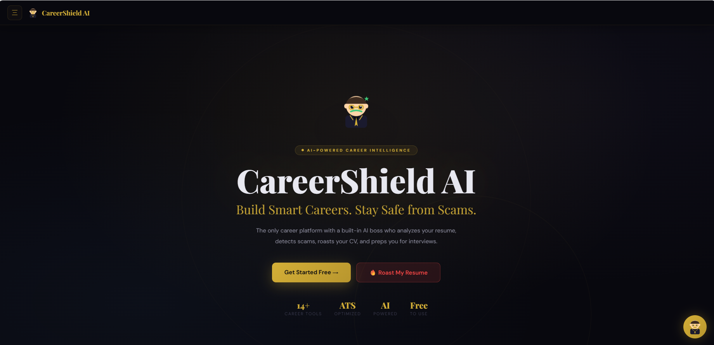</td>
    <td>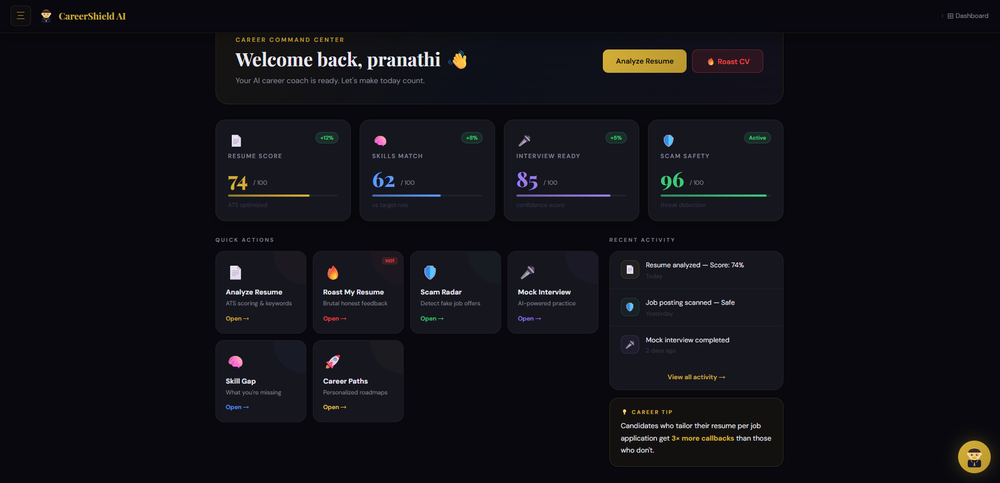</td>
  </tr>
  <tr>
    <td>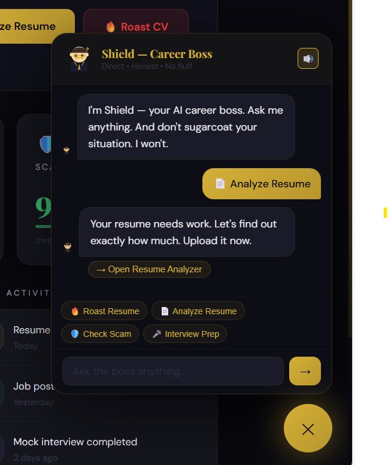</td>
    <td>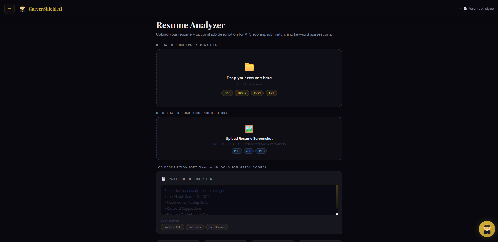</td>
  </tr>
  <tr>
    <td>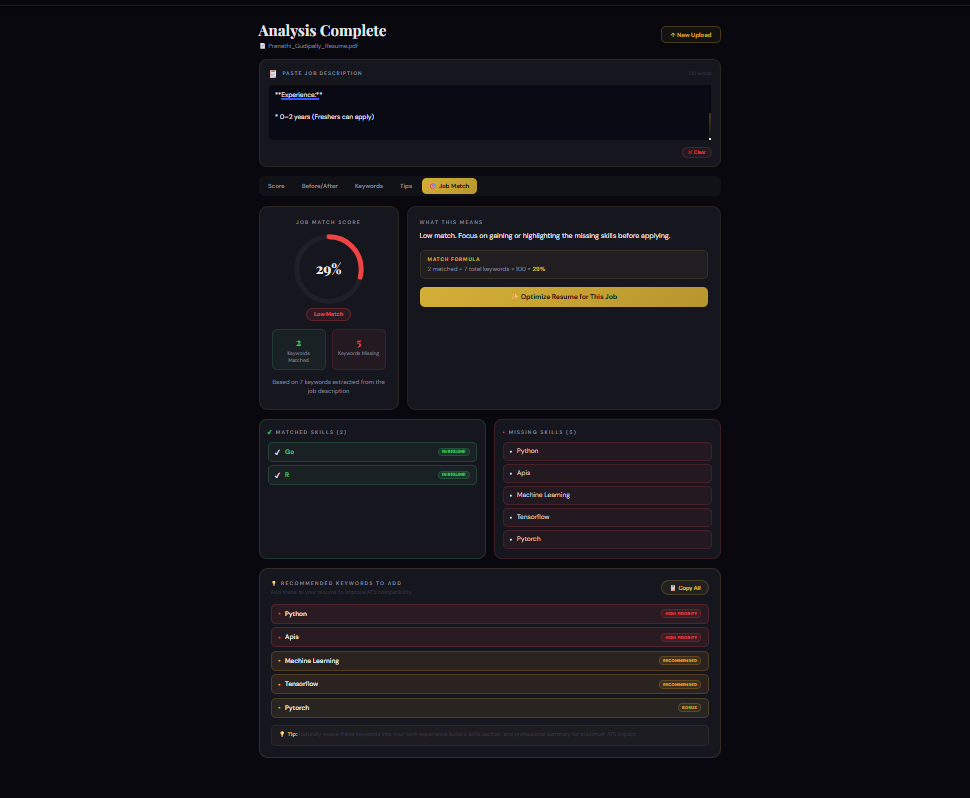</td>
    <td>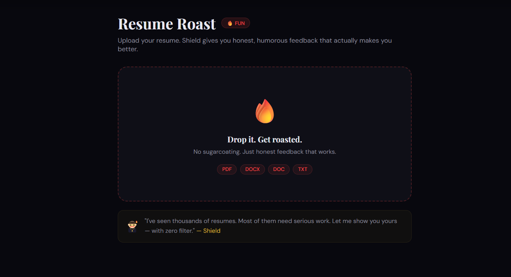</td>
  </tr>
  <tr>
    <td>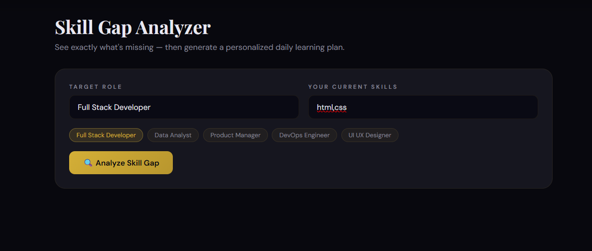</td>
    <td>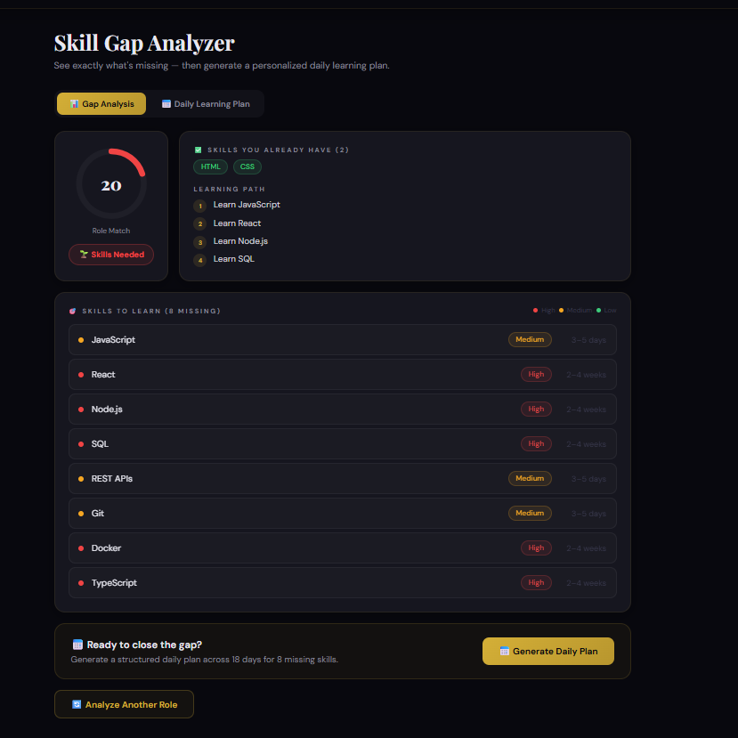</td>
  </tr>
  <tr>
    <td>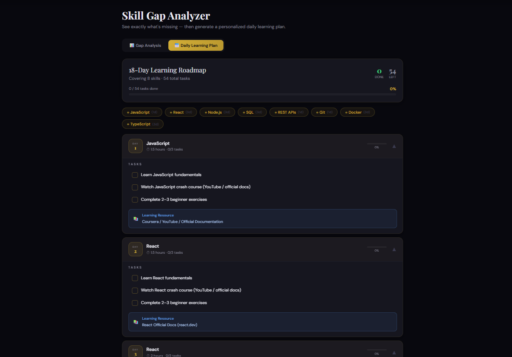</td>
    <td>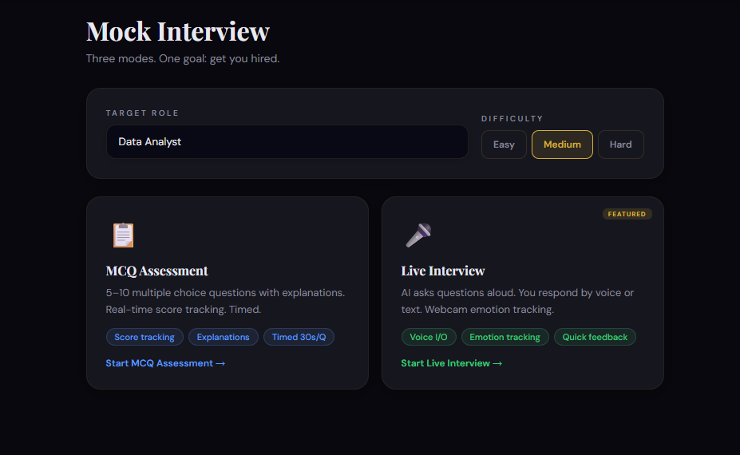</td>
  </tr>
  <tr>
    <td>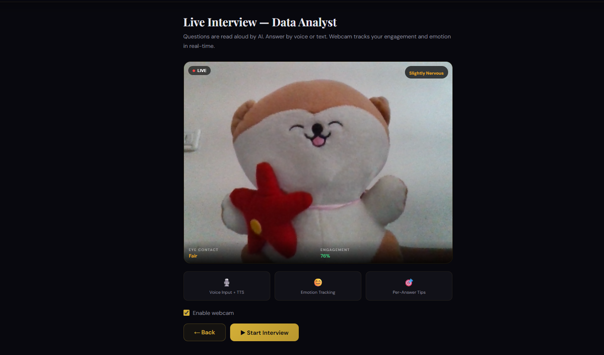</td>
    <td>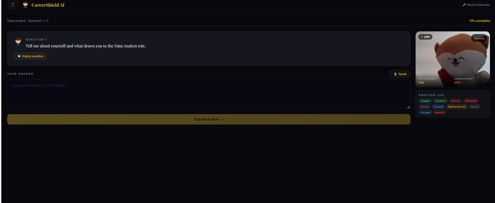</td>
  </tr>
  <tr>
    <td>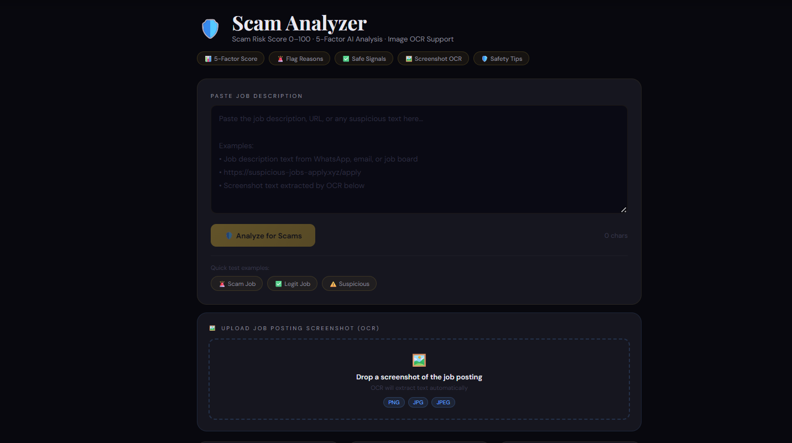</td>
    <td>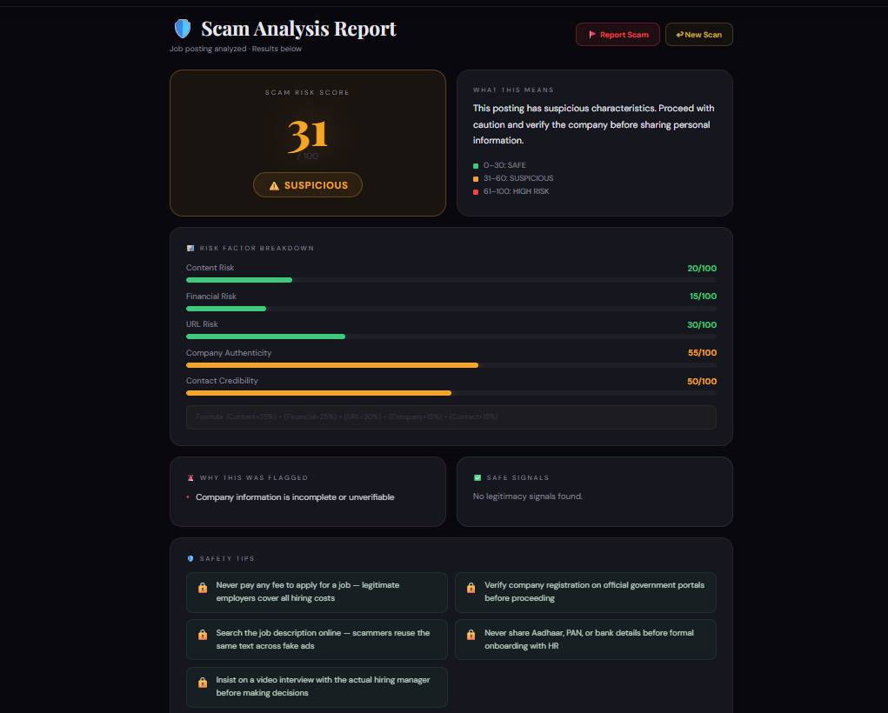</td>
  </tr>
  <tr>
    <td>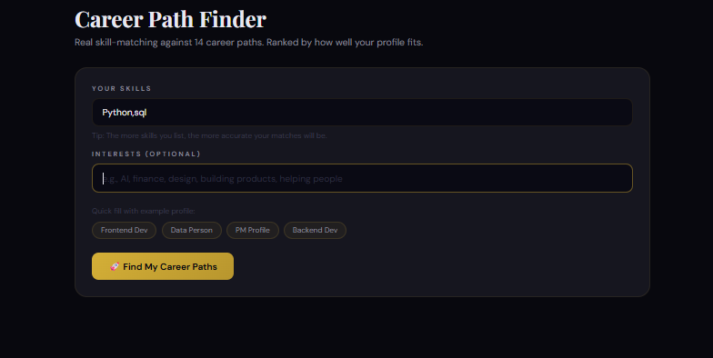</td>
    <td>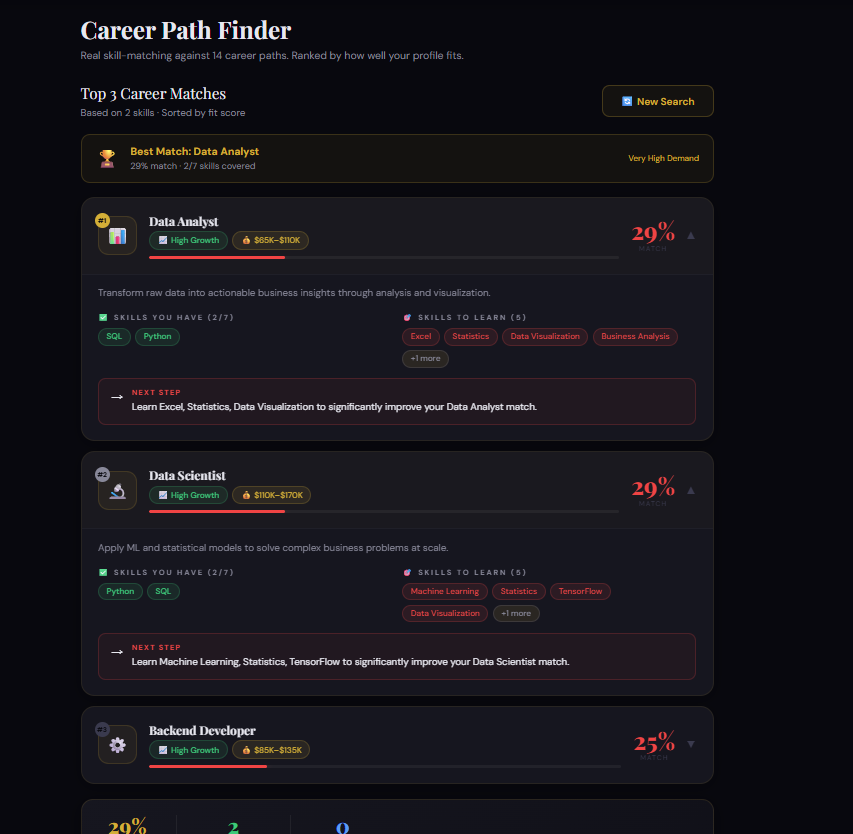</td>
  </tr>
</table>

---
## ⚡ Quick Start

### Prerequisites

- **Node.js** 18+ — [nodejs.org](https://nodejs.org)
- **MongoDB** — [Install locally](https://www.mongodb.com/try/download/community) or use [MongoDB Atlas](https://cloud.mongodb.com) (free tier)
- **Anthropic API key** — [console.anthropic.com](https://console.anthropic.com)

---

### 1. Clone / Extract

```bash
# If cloning from git:
git clone https://github.com/your-username/careerVision.git
cd careerVision

# Or just extract the ZIP and cd into it
```

---

### 2. Set Up the Backend

```bash
cd server

# Install dependencies
npm install

# Create your environment file
cp .env.example .env
```

Open `server/.env` and fill in:

```env
PORT=5000
NODE_ENV=development
MONGODB_URI=mongodb://localhost:27017/careershield
JWT_SECRET=your_long_random_secret_here
JWT_EXPIRES_IN=7d
ANTHROPIC_API_KEY=sk-ant-your_key_here
CLIENT_URL=http://localhost:5173
```

```bash
# Start backend (development – auto-restarts on change)
npm run dev

# Or for production:
npm start
```

Backend runs at **http://localhost:5000**

---

### 3. Set Up the Frontend

```bash
# From project root:
cd client

# Install dependencies
npm install

# Create your environment file
cp .env.example .env
```

Open `client/.env` and fill in:

```env
VITE_API_URL=http://localhost:5000
VITE_ANTHROPIC_API_KEY=sk-ant-your_key_here
```

> **Note:** `VITE_ANTHROPIC_API_KEY` is used for direct browser→AI calls in the demo. For production, route all AI calls through the backend and remove this from the frontend env.

```bash
# Start frontend (hot-reload dev server)
npm run dev
```

Frontend runs at **http://localhost:5173** 🚀

---

### 4. Open the App

Navigate to **http://localhost:5173** in your browser.

---

## 🔌 API Reference

All endpoints are prefixed with `/api`.

### Auth

| Method | Endpoint | Auth Required | Body |
|---|---|---|---|
| `POST` | `/api/auth/signup` | ✗ | `{ name, email, password }` |
| `POST` | `/api/auth/login` | ✗ | `{ email, password }` |
| `GET` | `/api/auth/me` | ✅ Bearer | — |

### Features

| Method | Endpoint | Auth | Body |
|---|---|---|---|
| `POST` | `/api/resume/analyze` | ✅ | `{ resumeText }` |
| `POST` | `/api/scam/detect` | ✅ | `{ jobDescription }` |
| `POST` | `/api/skills/gap` | ✅ | `{ jobRole, userSkills }` |
| `POST` | `/api/interview/questions` | ✅ | `{ role }` |
| `POST` | `/api/interview/feedback` | ✅ | `{ role, qa: [{question, answer}] }` |
| `POST` | `/api/career/recommend` | ✅ | `{ skills, interests }` |
| `POST` | `/api/chatbot/chat` | ✗ | `{ message }` |
| `GET` | `/api/health` | ✗ | — |

---

## 🎨 Design System

| Token | Value | Usage |
|---|---|---|
| Background | `#08080E` | Page background |
| Surface | `#111118` | Sidebar, modals |
| Card | `#16161F` | Feature cards |
| Gold | `#D4AF37` | Primary accent, CTAs |
| Green | `#3DCA7A` | Safe / positive |
| Yellow | `#F5A623` | Warning / suspicious |
| Red | `#F04444` | Danger / scam / roast |
| Purple | `#9B7FE8` | Interview score |
| Blue | `#5B9CF6` | Resources / info |

**Fonts:** Playfair Display (headings) + DM Sans (body)

---

## 🚀 Deployment

### Frontend → Vercel

```bash
cd client
npm run build         # Creates /dist
# Deploy /dist to Vercel
# Set environment variable: VITE_API_URL=https://your-backend.com
```

### Backend → Railway / Render / Fly.io

```bash
# Set all .env variables in your platform dashboard
# Start command: npm start
# Build command: npm install
```

### Database → MongoDB Atlas

1. Create a free cluster at [cloud.mongodb.com](https://cloud.mongodb.com)
2. Copy the connection string into `MONGODB_URI`
3. Whitelist `0.0.0.0/0` (or your server IP) in Network Access

---

## 🔐 Security Notes

- **Never commit `.env` files** — both `.gitignore` files exclude them
- In production, **remove `VITE_ANTHROPIC_API_KEY`** from the frontend and route all AI through the backend
- Use a strong, random `JWT_SECRET` (run `openssl rand -base64 64`)
- Set `NODE_ENV=production` in your server environment for production builds
- MongoDB Atlas has IP allowlisting — restrict to your server's IP in production

---

## 🛠️ Tech Stack

| Layer | Technology |
|---|---|
| Frontend | React 18, Vite 5 |
| Styling | Pure CSS-in-JS (no external UI lib) |
| Backend | Node.js 18+, Express 4 |
| Database | MongoDB + Mongoose 8 |
| Auth | JWT + bcryptjs |
| AI | Anthropic Claude (claude-sonnet-4) |
| Dev tools | Nodemon, ESLint |

---

## 📝 License

MIT — free for personal and commercial use.
